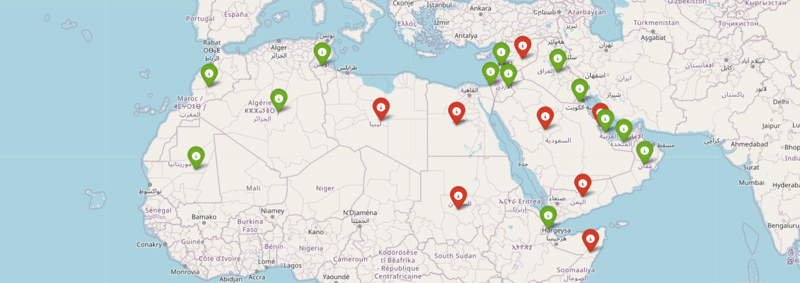

<html>
<body>
	<h1>OpenAI Services Availability on Interactive Map For Arab Countries</h1>
	
This Python script scrapes the OpenAI documentation page to extract the list of supported countries for their services (such as ChatGPT). It then exports the list of supported countries to a text file named "openai_supported_countries.txt" and categorizes the Arab countries into two lists: supported and not supported.

The script also generates an interactive map using the <code>folium</code> library to display the location of each Arab country and whether it is supported by OpenAI services. The map is color-coded to distinguish between supported countries (green) and not supported countries (red).

<h2>Requirements</h2>

To run this script, you need the following libraries installed:

<ul>
	<li>Selenium</li>
	<li>BeautifulSoup4</li>
	<li>Geopy</li>
	<li>Folium</li>
</ul>

You also need to have a compatible driver installed for your browser to use with the <code>selenium</code> library.

<h2>How to use</h2>

<ol>
	<li>Install the required libraries.</li>
	<li>Install the appropriate driver for your browser.</li>
	<li>Run the script using a Python interpreter (i.e. VSCode).</li>
	<li>An updated text file named "openai_supported_countries.txt" will be created in the same directory as the script.</li>
	<li>An interactive map will be displayed with markers for each Arab country, colored <b>GREEN</b> or <b>RED</b> depending on whether it is supported by OpenAI services. You can zoom in and out and click on each marker to view the name of the country.</li>
</ol>

Note: The script may take a few moments to run as it loads and renders the OpenAI documentation page using the <code>selenium</code> library.

<h2>Files</h2>

This repository contains the following files:

<ul>
	<li><code>openai_locations_map_4_arab_countries.ipynb</code>: The Python script for scraping the OpenAI page, exporting the list of supported countries to a text file, and generating an interactive map.</li>
	<li><code>openai_supported_countries.txt</code>: A text file containing the list of supported countries for OpenAI services.</li>
	<li><code>README.md</code>: The README file explaining the script and how to use it.</li>
	<li><code>map_8Mar2023.png</code>: Last updated OpenAI service availability map picture. (March 8, 2023).</li>
</ul>

<h2>Credits</h2>

This README file was created with some help from ChatGPT _a large language model trained by OpenAI_ using the following resources:

<ul>
	<li><a href="https://selenium-python.readthedocs.io/">Selenium documentation</a></li>
	<li><a href="https://www.crummy.com/software/BeautifulSoup/bs4/doc/">BeautifulSoup documentation</a></li>
	<li><a href="https://geopy.readthedocs.io/">Geopy documentation</a></li>
	<li><a href="https://python-visualization.github.io/folium/">Folium documentation</a></li>
	<li><a href="https://platform.openai.com/docs/supported-countries">OpenAI Supported Countries Documentation</a></li>
</ul>
</body>
</html>